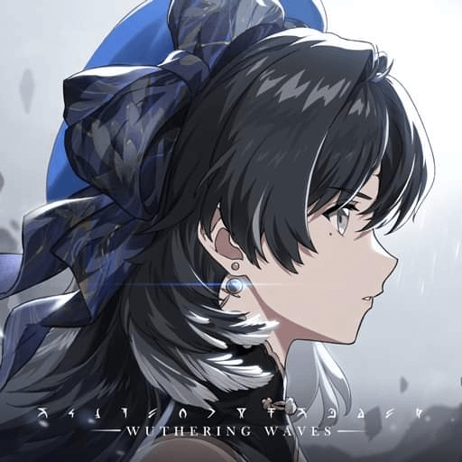

<div align="center">

  

# JingJoVH Linux Launcher

Launcher Việt Hóa Game trên Linux (Wuthering Waves & Neverness to Everness).

  <p align="center">
    <a href="https://github.com/jingjo07/JingJoVH-Launcher-Linux/releases"></a>
    <a href="https://discord.com/invite/uNRyaHJR6"></a>
    <a href="#"></a>
    <a href="#"></a>
    <a href="LICENSE"></a>
  </p>

  <br>

</div>

---

## 📌 Tính năng chính

- **Hỗ trợ đa tựa game**:
  - Chuyển đổi nhanh chóng giữa **Wuthering Waves (WuWa)** và **Neverness to Everness (NTE)** ngay tại thanh điều khiển.
  - Tự động nhận diện thư mục cài đặt game, Wine prefix, cấu hình đồ họa và tình trạng cài đặt mod riêng biệt cho từng game.

- **Tải và cài đặt Việt Hóa tự động**:
  - **Wuthering Waves**: Tự động tải bản dịch mới nhất từ DangDev (`WuWaVH_99_P.pak` & `winhttp.dll`).
  - **Neverness to Everness (NTE)**: Tự động tải, giải nén và triển khai mod Việt Hóa vào thư mục game (`HT/Content/Paks/zzz_NTEVH_99_P.pak` & `HT/Binaries/Win64/winhttp.dll`).

- **Bộ sưu tập giao diện (Theme) riêng biệt**:
  - **Wuthering Waves**:
    - _Cổ Kính_: Thanh điều hướng cổ điển, viền kim loại vàng hoàng gia.
    - _Hiện Đại_: Thanh dock thu gọn bên trái, hiệu ứng kính mờ và màu xanh Mint.
    - _Thủy Mặc_: Phong cách tranh thủy mặc Trung Hoa tinh tế và khung viền cổ phong.
  - **Neverness to Everness (NTE)**:
    - _Cyber_: Giao diện viễn tưởng với ánh sáng Glitch Teal và lưới tọa độ tương lai.
  - Video nền và nhạc nền sống động riêng biệt theo từng tựa game.

- **Tối ưu hóa hiệu năng đồ họa (Engine.ini)**:
  - Cung cấp sẵn các mức đồ họa tối ưu (Cực cao, Cao, Trung bình, Tiết kiệm, Siêu nhẹ) từ các bộ cấu hình chuẩn của cộng đồng:
    - WuWa: Nguồn cấu hình [AlteriaX/WuWa-Configs](https://github.com/AlteriaX/WuWa-Configs).
    - NTE: Nguồn cấu hình [AlteriaX/NTE-Configs](https://github.com/AlteriaX/NTE-Configs).
  - Tùy chọn tiện ích cho NTE: Mở thiết lập Lumen, Bỏ video giới thiệu khởi động, Tắt mouse smoothing / FOV scaling.
  - Khôi phục Engine.ini gốc dễ dàng bất kỳ lúc nào chỉ bằng một nút bấm.

- **Quản lý Font chữ (WuWa & NTE)**:
  - Hỗ trợ đổi font chữ hiển thị trong game bằng file font `.ttf`, `.otf` hoặc file `.pak` có sẵn cho cả hai tựa game.
  - Tự động nạp, chuyển đổi định dạng và đóng gói font vào PAK game hoặc PAK Việt Hóa.
  - Khôi phục font gốc dễ dàng (LaguSans Bold cho WuWa, MiSans cho NTE).

- **Cấu hình WINEDLLOVERRIDES & Trình khởi chạy**:
  - Tự động cấu hình `WINEDLLOVERRIDES="winhttp=n,b"` cho cả Steam và Heroic để game nạp proxy DLL việt hóa.
  - Hỗ trợ lựa chọn nền tảng khởi chạy: Steam hoặc Heroic Games Launcher cho WuWa; Heroic, Steam hoặc Wine chính thức cho NTE.
  - Hỗ trợ chỉ định thủ công đường dẫn Wine/Proton prefix cho NTE khi chạy ngoài các launcher chuẩn.

---

## 📥 Cách cài đặt và sử dụng

### 1. Dùng file AppImage (Khuyên dùng)

Tải file thực thi từ mục [Releases](https://github.com/jingjo07/JingJoVH-Launcher-Linux/releases):

```bash
chmod +x JingJoVH-Launcher-x86_64.AppImage
./JingJoVH-Launcher-x86_64.AppImage
```

_(Nếu hệ thống của bạn trước đây dùng tên `WuWaVH-Launcher-x86_64.AppImage`, bạn có thể đổi tên hoặc tiếp tục sử dụng file tương thích được tạo kèm)_.

### 2. Chạy từ mã nguồn

Nếu muốn chạy trực tiếp bằng Python, hệ thống cần cài sẵn Python 3, WebKit2GTK và Aria2:

- **Arch Linux / CachyOS / Manjaro**:
  ```bash
  sudo pacman -S python webkit2gtk-4.1 aria2
  ```
- **Ubuntu / Debian**:
  ```bash
  sudo apt install python3 python3-gi gir1.2-webkit2-4.1 aria2
  ```
- **Fedora**:
  ```bash
  sudo dnf install python3 python3-gobject webkit2gtk4.1 aria2
  ```

Khởi chạy ứng dụng:

```bash
git clone https://github.com/jingjo07/JingJoVH-Launcher-Linux.git
cd JingJoVH-Launcher-Linux
python3 launcher.py
```

---

## ⚙️ Cài đặt WINEDLLOVERRIDES (Wine / Proton)

Để Wine/Proton nạp file `winhttp.dll` và nhận bản Việt Hóa:

### Cách 1: Tự động qua Launcher (Đơn giản nhất)

1. Tắt game và launcher của game (Steam / Heroic) nếu đang mở.
2. Bấm vào nút menu nhanh `≡` (hoặc mở menu Drawer bên trái) ➔ Chọn **Cài WINEDLLOVERRIDES**.
3. Launcher sẽ tự động quét và nạp `winhttp=n,b` vào registry của tất cả Wine/Proton prefix cũng như cấu hình Steam và Heroic Games Launcher.

### Cách 2: Thiết lập thủ công trên Steam

1. Chuột phải vào **Wuthering Waves** (hoặc game NTE được thêm dưới dạng Non-Steam Game) trong thư viện Steam ➔ Chọn **Properties...**
2. Tại tab **General**, tìm ô **Launch Options** và điền:
   ```text
   WINEDLLOVERRIDES="winhttp=n,b" %command%
   ```
   _(Nếu muốn chạy WuWa ở chế độ DirectX 11 chống crash, thêm cờ `-dx11`: `WINEDLLOVERRIDES="winhttp=n,b" %command% -dx11`)_.

### Cách 3: Thiết lập trên Heroic Games Launcher

1. Mở Heroic ➔ Chọn game **Wuthering Waves** hoặc **Neverness to Everness** ➔ Vào phần **Settings**.
2. Chọn mục **Environment Variables** ➔ Thêm biến mới:
   - **Key**: `WINEDLLOVERRIDES`
   - **Value**: `winhttp=n,b`

---

## 🔨 Đóng gói AppImage

Để tự biên dịch file `.AppImage` trên máy:

```bash
chmod +x build_appimage.sh
./build_appimage.sh
```

File đóng gói sẽ được tạo ra tại thư mục hiện tại: `JingJoVH-Launcher-x86_64.AppImage` (kèm liên kết tương thích `WuWaVH-Launcher-x86_64.AppImage`).

---

## 💬 Cộng đồng & Hỗ trợ

Tham gia máy chủ Discord để cùng thảo luận, cập nhật thông tin về Việt Hóa và hỗ trợ kỹ thuật:  
👉 **[Tham gia máy chủ Discord IRIS](https://discord.com/invite/uNRyaHJR6)**

---

## 🤝 Nguồn tài nguyên & Lời cảm ơn

- Dữ liệu bản dịch Việt Hóa từ **DangDev (Iris Team)** ([Link repo](https://huggingface.co/datasets/BachMacThanh/DangDevVH/tree/main)).
- Bộ thông số tối ưu Engine.ini từ **AlteriaX** ([WuWa-Configs](https://github.com/AlteriaX/WuWa-Configs) & [NTE-Configs](https://github.com/AlteriaX/NTE-Configs)).

## ⚠️ Lưu ý bản quyền

- Ứng dụng là công cụ mã nguồn mở độc lập hỗ trợ người dùng Linux, không thuộc quyền sở hữu của Kuro Games hay Hotta Studio.
- Mọi thắc mắc hoặc báo lỗi liên quan đến Launcher, vui lòng tạo issue trên GitHub repository.

## 📄 License

_**[GNU General Public License v3.0 (GPLv3)](LICENSE)**. Bạn được tự do sử dụng, sửa đổi và chia sẻ mã nguồn với điều kiện các bản phái sinh cũng phải mở mã nguồn tương tự._
